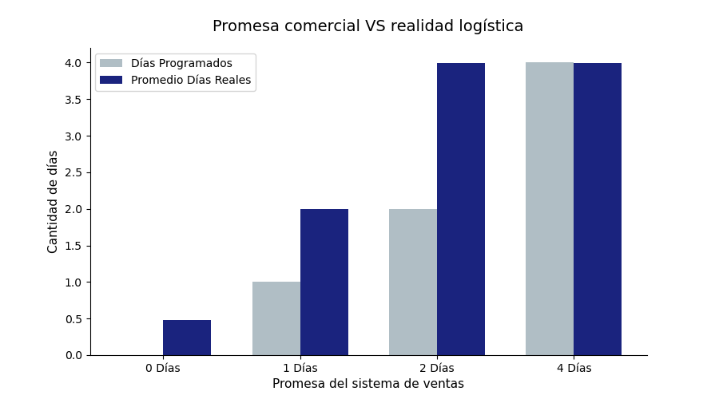

# Analítica de Datos Aplicada a la Optimización Logística: Promesa vs. Realidad

## 1. Visión General del Proyecto
Este proyecto nace de una problemática crítica en la cadena de suministro de una compañía global de e-commerce. Existe una desconexión severa entre el sistema comercial (las promesas de entrega generadas en la plataforma web) y la operación física (los tiempos reales de despacho y transporte en calle). 

El objetivo de este análisis es evaluar la magnitud de este desfase utilizando ciencia de datos, identificar los puntos críticos de incumplimiento y proponer soluciones estratégicas basadas en evidencia para proteger la experiencia del cliente.

## 2. Herramientas y Tecnologías
* **SQL (SQLite):** Filtrado, exploración inicial y extracción de las variables clave del dataset histórico (`DataCo Supply Chain`).
* **Python (Pandas):** Procesamiento de datos, limpieza de inconsistencias latinas, agrupamiento (`groupby`) y cálculo de métricas operativas.
* **Matplotlib & NumPy:** Diseño e implementación de una visualización geométrica grupal bajo estándares estéticos minimalistas.

## 3. Análisis Visual

## 4. Hallazgos Clave e Insights de Negocio
Al contrastar las métricas mediante la visualización de datos, se identificaron los siguientes patrones críticos:

* **Efecto Espejo del Desfase (100% de retraso):** Cuando el sistema comercial promete entregas urgentes en **1 Día**, la flota logística tarda en promedio **2 Días**. De igual manera, cuando la promesa es de **2 Días**, la realidad operativa se duplica a **4 Días**.
* **Quiebre de Confianza:** El incumplimiento es total en las categorías de entrega más rápidas, lo que genera una alta tasa de reclamos en servicio al cliente y destruye la retención de usuarios.
* **Inercia en Envíos Estándar:** Únicamente en los envíos programados a 4 días la operación logra emparejar la promesa comercial.

## 5. Recomendaciones Estratégicas (Plan de Acción)
Como Consultor de Datos, se proponen las siguientes acciones para la gerencia de operaciones:

1. **Margen de Precaución Dinámico:** Implementar un "colchón" de días preventivo en el algoritmo de despacho web para absorber imprevistos en ruta (tráfico, accidentes, clima) y mitigar las llegadas tardías de inmediato.
2. **Segmentación Rigurosa por Producto:** Desarrollar un análisis secundario enfocado en la categoría, volumen y peso del producto. Factores como el tamaño impactan los tiempos de carga en bodega, por lo que las promesas web deben ser dinámicas y calculadas según el inventario seleccionado.
